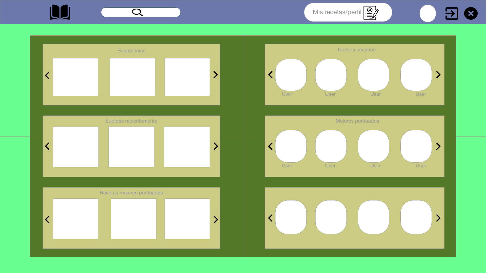
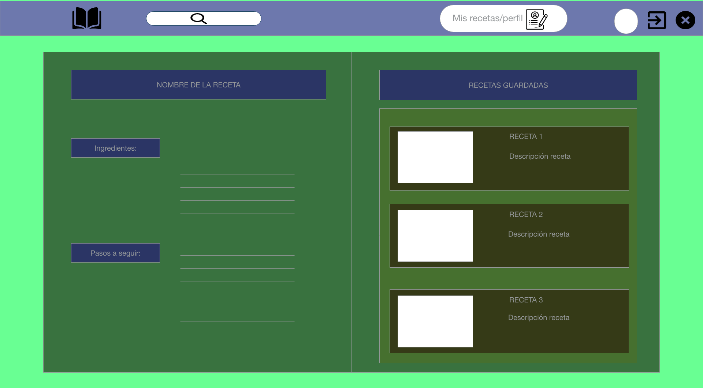
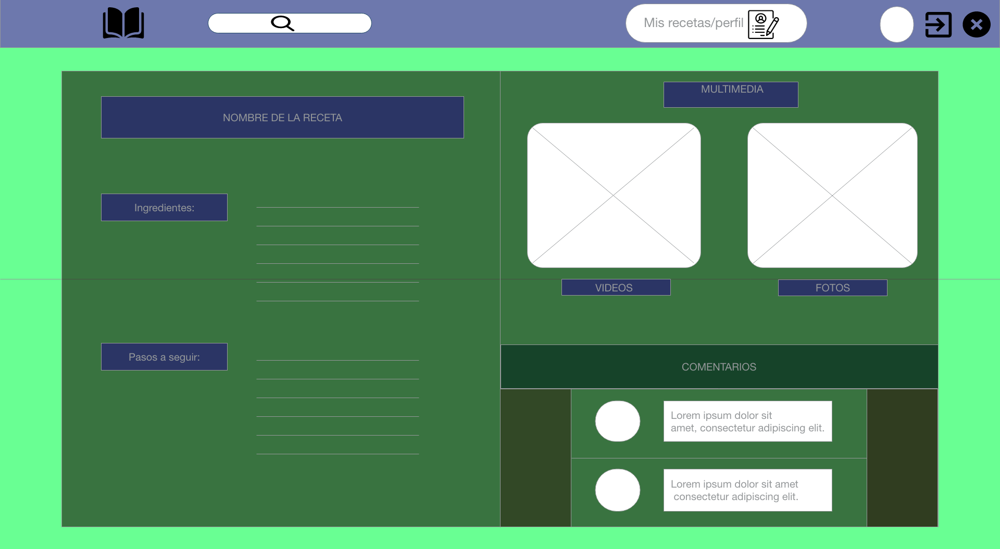
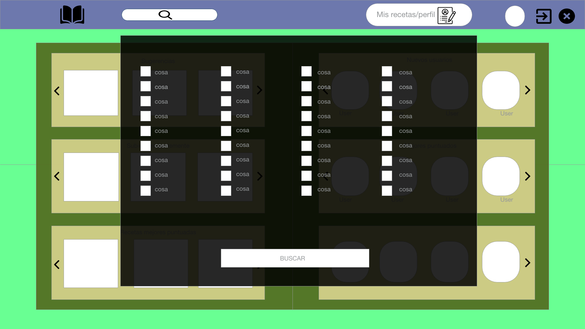
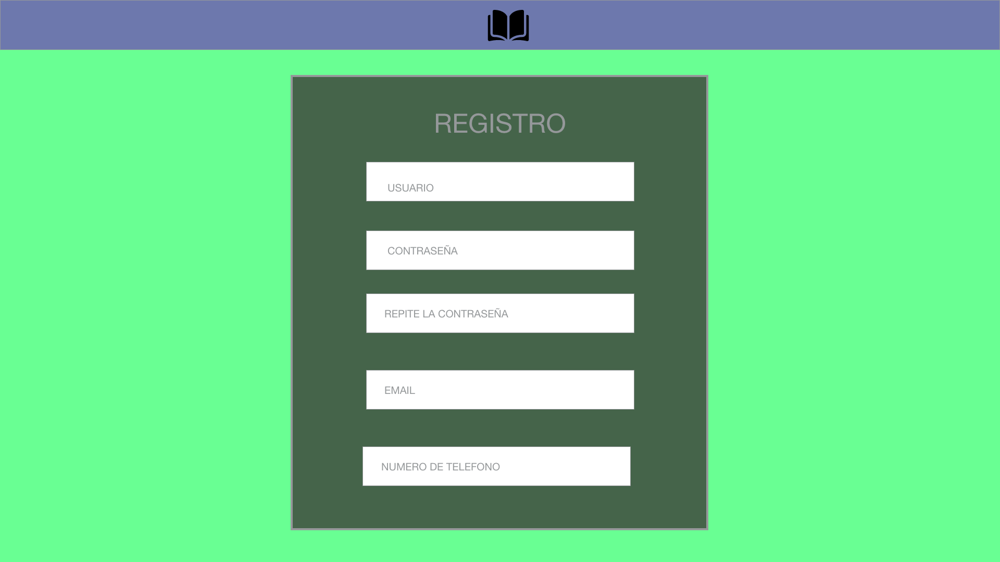
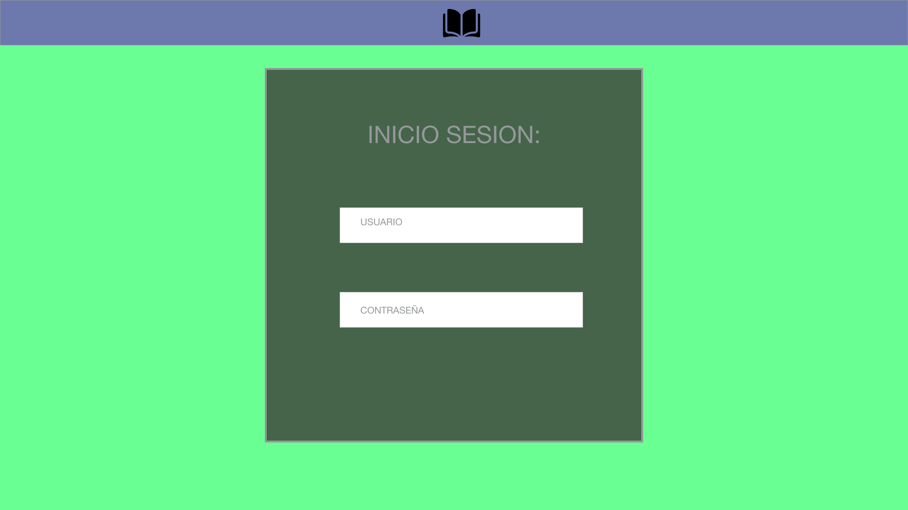

# CookBook-Frontend  &#x1F372;

## FrontEnd Design &#x1F6A7;

Aplicación intuitiva y de fácil utilización para todo tipo de usuarios, tanto para difundir como buscar recetas de cocina, recomendación de recetas según los alimentos disponibles, gran tipo de variedad para todo tipo de consumidores, desde niños hasta deportistas que necesitan consumir una determinada dieta.

## Equipo

- [@Carlos A.](https://github.com/bolften)
- [@Fran N.](https://github.com/frannav)
- [@Alexa S.](https://github.com/AlexaGSC)

## Diseño

Proyecto realizado en Adobe.

### Página de inicio

### Página de usuario

### Recetas

### Buscador

### Sign Up

### Sign In

## Desarrollado en JavaScript &#x1F4BB; 

### Features.

| &#x1F300; React| Biblioteca JavaScript| 
| -------- | -------- |
| :package: Webpack  | Automatizador    |
|----------|---------|
| :card_file_box: Babel| Compilador ES2015|

